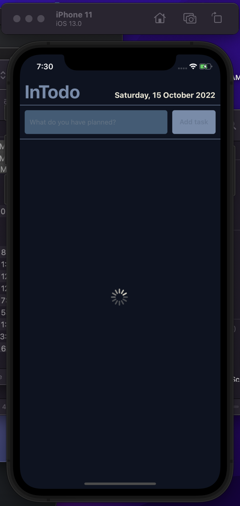
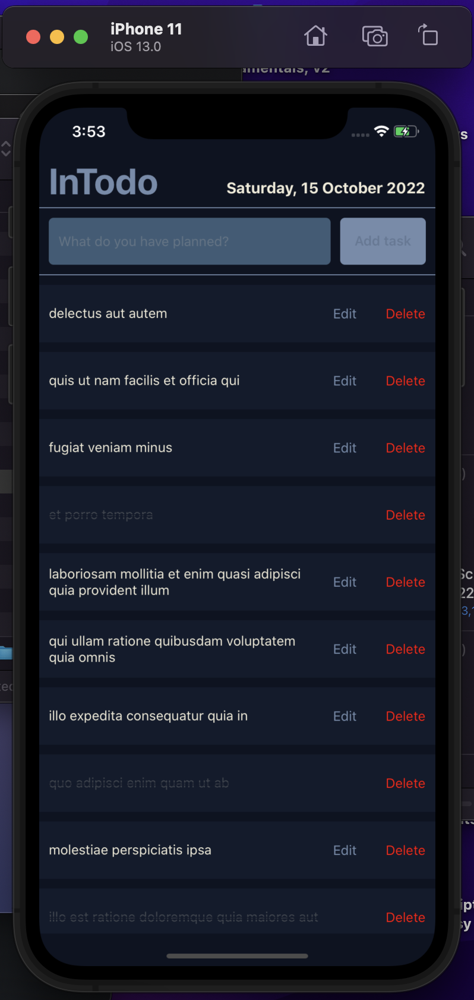
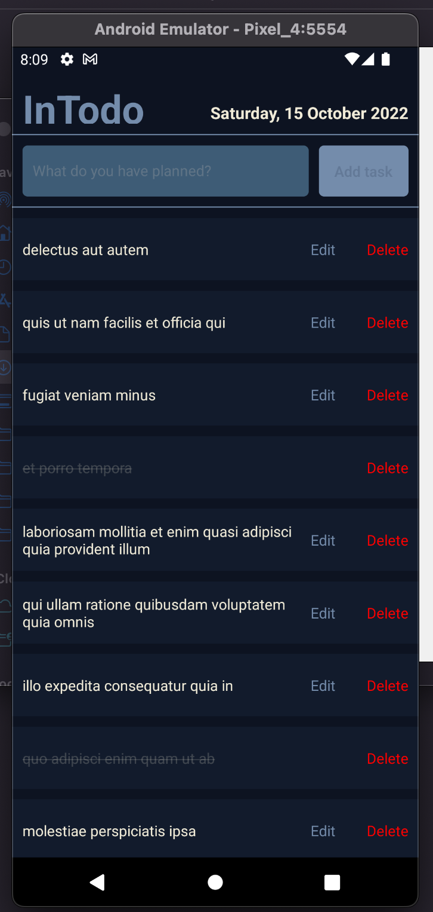
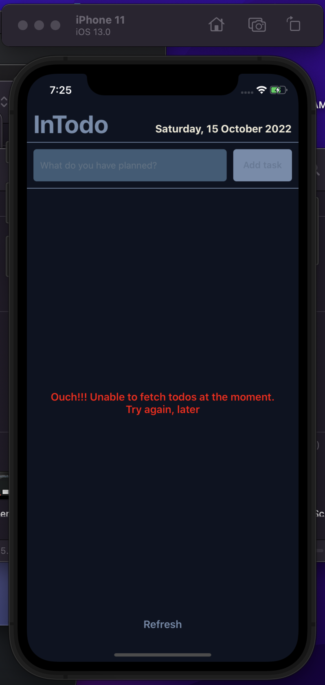

# Insync Technical Assessment

## Task

### Basic requirements

- Create a todo list app using react native
- You should be able to create, read, update and delete a todo
- Push the completed todo list to a github repo (add insyncdevteam@gmail.com to the repo)
- The styling of the app is not important just functionality
- Making use of an [external api](https://jsonplaceholder.typicode.com/todos)

## Result

### Tech used

- React Native (Bare) : for implementing the UI
- Context API : for state management
- Fetch API : for fetching data from external API
  _No third-party package(s) were installed_

### To run project

##### Clone the project and open it in the terminal. Then enter the following commands one after the order to start the app

    yarn install
    yarn ios or yarn android

### Implementation

- On App start, it fetches the data from the [external api](https://jsonplaceholder.typicode.com/todos), renders a loading indicator while fetching data, as shown below. 
- On successful fetching of data, it renders the data on the list as shown below.  
   iOS | Android
  :-------------------------:|:-------------------------:
   | 
- If unable to fetch data due to an error, it renders an error message and a refresh button bellow the screen to retry the data fetching operation, as shown below. 
- To delete task, you simply press the _Delete_ and likewise to edit task, you press on the _Edit_. For editing, an input field for editing the task, and then you press the _Save_ afterwards.
- To change the (complete) status of the task, you press and hold (or Long-press) on the task, then it changes the status.
- The task which is completed is double-striked through, it's opacity reduced and the _Edit_ is hidden
